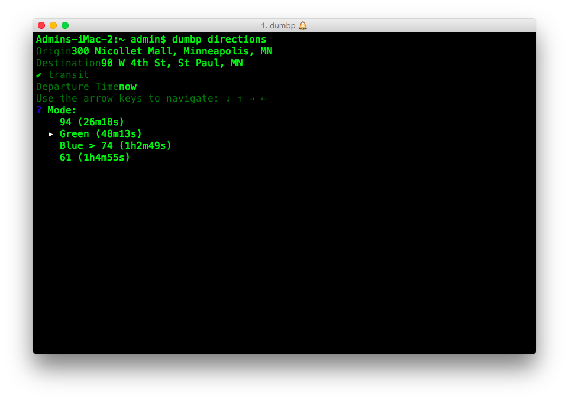

# Dumbphone

This is a command-line tool for making my Alcatel A392CC flip phone just a little bit smarter. It builds on a few other projects in various states of completion:

 - https://github.com/andyinabox/dumbp-a392cc-cli
 - https://github.com/andyinabox/dumbp-gmap-directions
 - https://github.com/andyinabox/dumbp-read

**Note:** For me this is a Go learner project so use at your own risk.

# Goals

 - [x] Basic cli framework (`dumbp` command)
 - [ ] `directions` command that generates HTML directions to be transfered to a phone (already implemented in python in the [dumbp-gmap-directions](https://github.com/andyinabox/dumbp-gmap-directions) repo
 - [ ] bluetooth file transfer (already in [dumbp-gmap-directions](https://github.com/andyinabox/dumbp-gmap-directions))
 - [ ] filesystem file transfer (when using phone as external drive)
 - [ ] `podcast` command that will download podcasts to be transfered to phone
 - [ ] `calendar` command that will sync with Google Calendar using `.vcf` files
 - [ ] `music` command that makes managing music on phone easier
 - [ ] `sync` command that will automatically sync multiple functions
 - [ ] `config` command for configuring different functions
 - [ ] `reader` command for syncing articles to phone (there's already a python implementation in [dumbp-read](https://github.com/andyinabox/dumbp-read)

